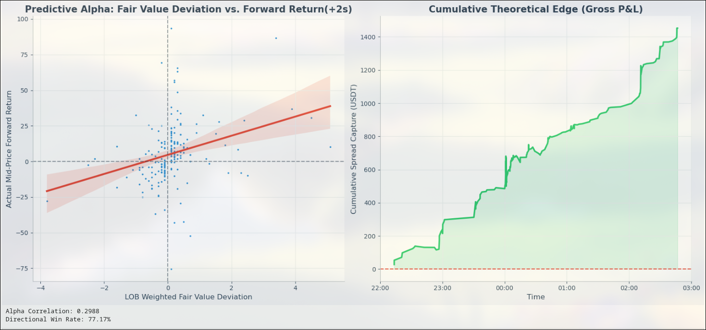

# High-Frequency LOB based Predictive Engine

### Executive Summary
A low-latency C++ market data ingestion and microprice calculation engine targeting the BTC/USDT limit order book.

Performance: +0.29 Predictive Alpha Correlation. Strategy: LOB-Weighted Fair Value Deviation.

### Technical Stack
* **Language:** C++17, Python 3.10 (Validation).
* **Core Math:** Exponential Decay Depth-Weighting (Calculates the "center of mass" of the order book).
* **Data:** Live Binance WebSocket API (Level 5 Partial Book at 100ms intervals).
* **Logic:**
  * **Asynchronous Networking:** Uses `boost::asio` and `boost::beast` libraries to manage non-blocking WebSocket streams and SSL handshakes.
  * **Microstructure Engine:** Processes live JSON payloads using `RapidJSON` to calculate Order Flow Imbalance (OFI) and Micro Fair Value Deviations in real-time.
  * **Validation:** Correlates generated signal against actual $t+2000ms$ forward returns to verify predictive edge.

### Results
* **Alpha Correlation:** +0.2988
* **Directional Win Rate:** 77.17%
* **Validation:** Simulated Gross Mark-to-Market P&L (zero-latency/zero-fee assumption) demonstrates a continuous structural edge across shifting market regimes.

